# Error Control Laboratory Plan
[toc]

Task| Finished Data | Comment(Progress)  | 
:--- | :---: | :---: | 
install environments |2016.04.12 |Before attempting to run any App|
Android Tutorial |2016.04.12 |[Android Tutorial1 ](http://developer.android.com/training/basics/firstapp/index.html) [Android Tutorial2 ](http://www.tutorialspoint.com/android/index.htm) [官网中文教程 ](http://hukai.me/android-training-course-in-chinese/basics/index.html)
Design framework |2016.04.15 | navigate draw
Task1 |2016.04.17 |
Task2 |2016.04.19 |
Task3 |2016.04.20 |Figure out hybrid ARQ strategy
Task4 |2016.04.21 |
Task5 |2016.04.25 |
Task6 |2016.04.27 |

##Changelog
###2016.04.13 Design Framework.
For method B, app should request the data from the server by sending a unicast UDP message `NACK1` to the server's port 5000. The server will reply to whatever port your unicast was sent from. Connect to mobileC wifi on the laptop and ip 192.168.0.100.


- navigate draw
- MainActivity edit selected item
- Every task use fragment


###2016.04.17 finished task 1

- add permission in the file `Androidmanifest`.
- add UDP communication in the file `clienttask`.
- Use AsyncTask method (thread)
- Use onPostExecute
- onTaskCompleted function handle the received package. Convert to string and show on the screen.

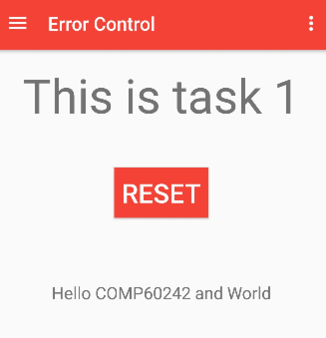


###2016.04.19 finished task 2


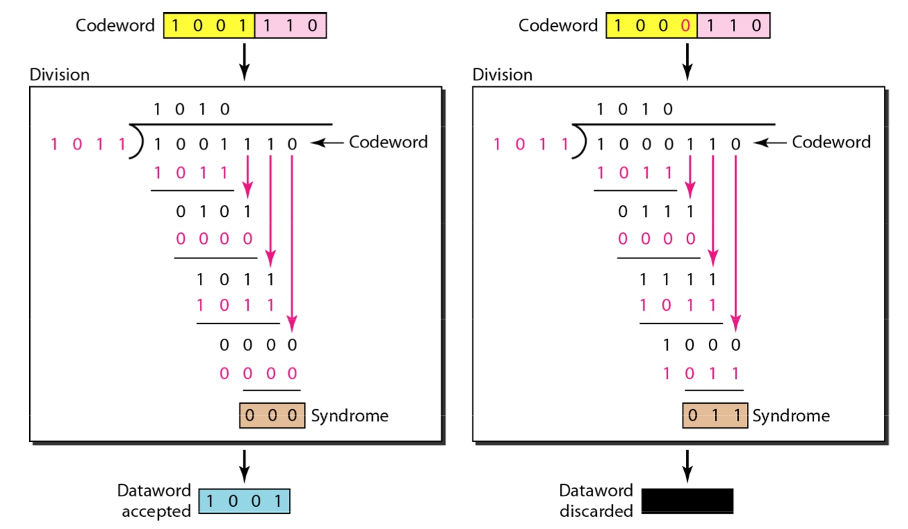


- add ErrorControl class to deal with some error detection,such as crc.
- CRC8 is - Least significant bit processed first. In most implementations it needs to process the next 9 bits before shifting everything by one bit to take the next bit from the input stream. For example, upper case 'H' is 72 in decimal or 0x48 or 01001000 in binary. the bits are processed from right to left thus they arrive in the order 0 0 0 1 0 0 1 0 from the input sequence.

Use crc8 to detect error.
When the package is incorrect,
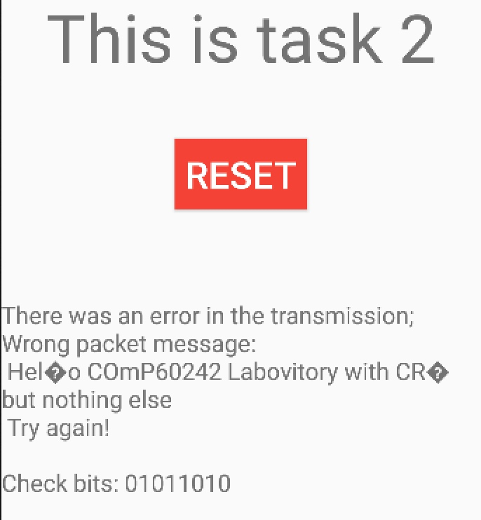

When the package is correct,
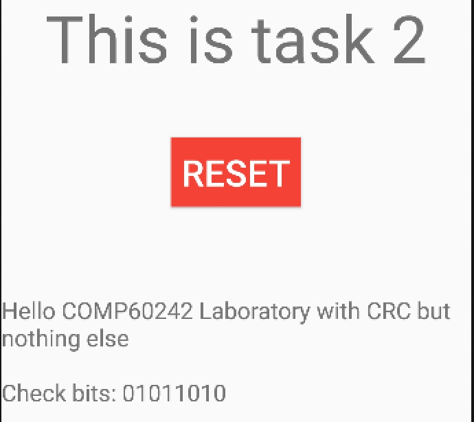


###2016.04.20 finished task 3
 
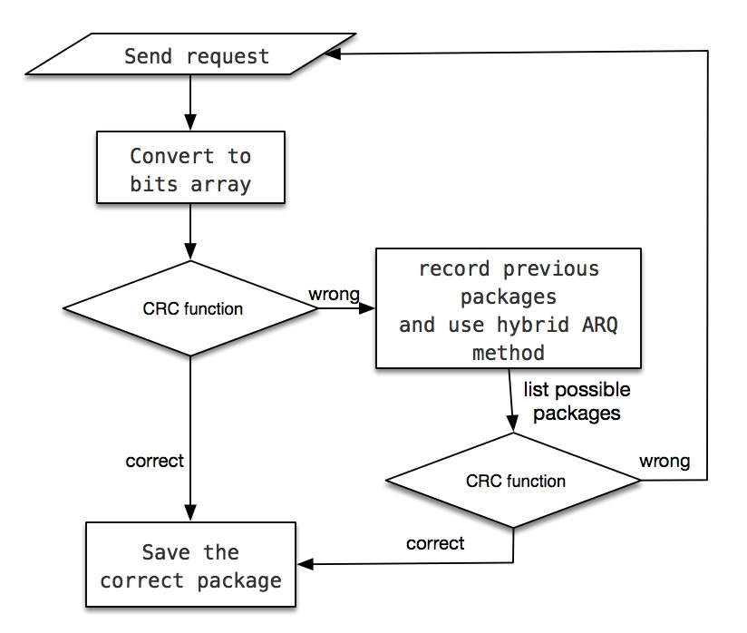

 
 - Combination of automatic repeat request and forward error correction. It improves performance.

 
 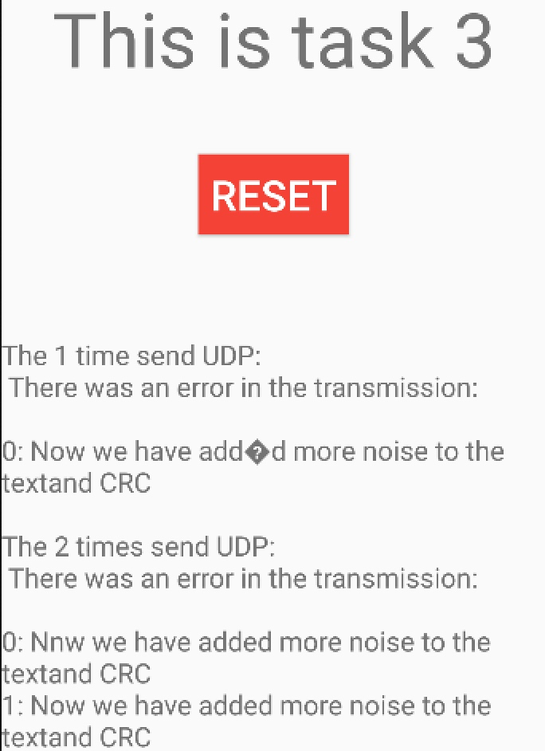
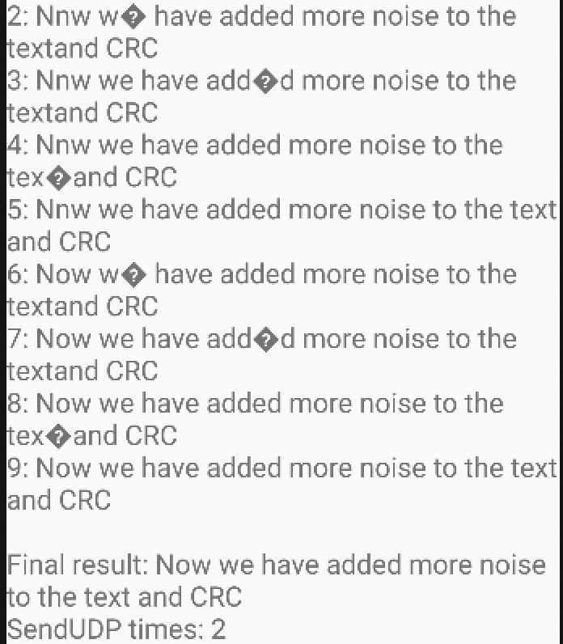


###2016.04.21 finished task 4
[Bakercode wiki](https://en.wikipedia.org/wiki/Barker_code)
Barker code for Task 1.4 on Direct Sequence Spread Spectrum (DSSS) is `10110111000`. The idea is is to use a noise like bit sequence to spread the signal.In WiFi the spreading was done by using 11 times wider bandwidth. For this laboratory we spread the signal in time.
It uses different codes for 0 and 1 which are often simply the inverse of one another. IEEE802.11 uses the Barker code `10110111000` XOR'd with each data bit to be transmitted. So, for example 0 stays as `10110111000` whereas 1 after XOR becomes the broadcast pattern `01001000111`. 

At the receiver without any noise effecting the transmitted bits each group of 11 received bits will either be exactly `10110111000` (0) or 01001000111 (1). However, some bits may be changed due to noise, so the receiver has to work out which of the two patterns is closest to the received pattern of bits. This is easy, we simply count how many bits are exactly what we expect to see for a 0 and a 1. The bigger count winning! Values around 5 or 6 of course are ambiguous so it may be necessary to guess. If the CRC then fails you could try flipping the most ambiguous choices to see if the data is then correct. Saving a retransmission is almost always a good idea!

Example:

```
We receive  1  0   0  1  0  1   1  0  0  0  0
XOR with     1  0   1  1   0  1  1  1  0   0  0
```
Gives ===    0+0+1+0+0+0+0+1+0+0+0 = 2. Therefore it is closest to 10110111000 (0).

We have 2 ones and 9 zeros, 9 is closest to 11 so this was transmitted as a 0 bit!

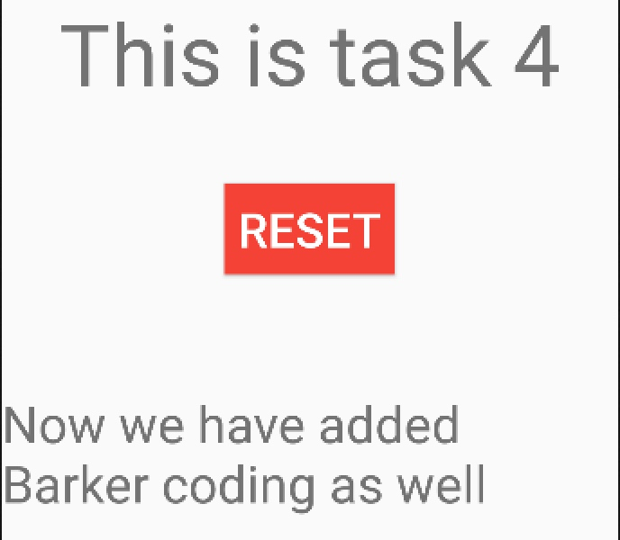

###2016.04.25 finished task 5
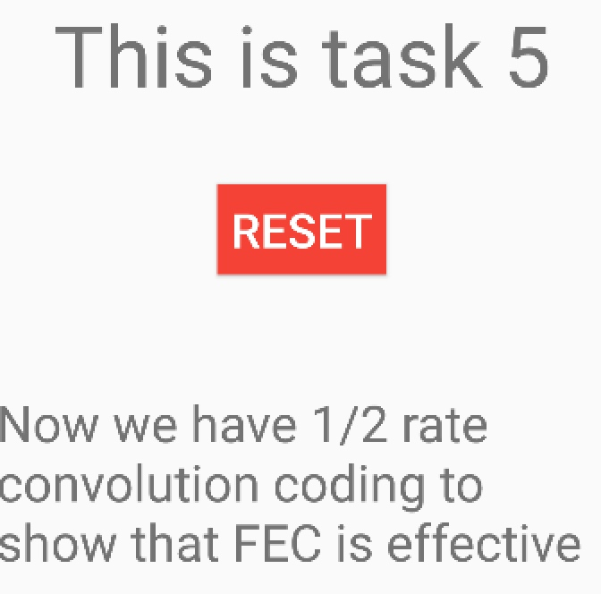

###2016.04.27 finished task 6

Audio:
Hello operator operator, yes what can I do for you


##Questions
**Task1**: Receive ASCII text message(20 Marks)

 - Goal: Receive and display a simple message, consisting of a string of ASCII characters transmitted by the server as a single packet.
 - Questions:
	1. [x] What is the string being sent? 
	2. [x] If you are using a smart-phone with WiFi, move it away from the transmitter slowly and observe what happens as the distance increases. Observe the effect of any errors. Consider what you would expect to occur. Do you expect to see any incorrect characters in the received message? If so explain why. 
	3. [x]When you get far enough away, your receiver will eventually stop receiving packets. Will this start to happen gradually as you move away? 
	4. [x]Explain what is happening at the Physical and Data link layers of the wireless connection as you move away from the transmitter.

 - summary: In Task 1, the application sends a negative
    acknowledgment (NACK) to the server. The server then replies with a UDP packet containing a string. This string is then displayed.

**Task2**:
Questions:

1. [x]It is possible that sometimes the CRC will appear correct but the message will still be wrong. How can this happen and how are such occurrences minimised? 
2. [x]Why do the bit-errors arise in WiFi transmissions and how can their number be reduced? 
3. [x]This is one of many possible ‘automatic request repeat’ (ARQ) schemes. Which scheme is used in the IEEE 802.11 MAC layer?

For Task 2, the server again replies with a UDP packet. However, this packet may contain simulated errors. The application must detect whether the packet is damaged by applying a cyclic redundancy check (CRC) algorithm.


**Task3**:
Questions:

1. [x]Explain your hybrid ARQ strategy.
2. [x]Measure its success by counting the number of successful messages received in a given time.
3. [x]How is the number of retransmissions affected?
4. [x]Why is hybrid ARQ not used in IEEE802.11 WiFi, and why is it better suited to WiMax and LTE?


Task 3 is similar to Task 2 except that more bit errors are simulated. The application must implement an algorithm that can combine damaged packets to form a correct packet


**Task4**:
Questions:

1. [x]Do you see any erroneous characters? If so explain why these occur, and if not explain their absence. 
2. [x]Why is spectral spreading used in IEEE 802.11b WiFi? 
3. [x]Why is spectral spreading used in cellular mobile telephony? 
4. [x]Do you believe spectral spreading to be an efficient ‘forward error control’ (FEC) mechanism? Explain your reasons (briefly).

In Task 4, the packet has now been DSSS encoded with errors simulated after the encoding. Using a spreading code, the application must decode the message, taking into account any bit errors and apply CRC.


**Task5**:
Questions:

1. [x]What is the message and was it displayed correctly? 
2. [x]If you believed there to be no bit-errors, could you have discerned the message without the Viterbi decoder? 
3. [x]Why does the transmitter ‘flush’ the encoder’s memory at the end of the message?


For Task 5, this time a message is half rate FEC coded using a convolution coder. The application must use a Viterbi decoder and again apply a CRC to determine the original message.


**Task6**:
Questions:

1. [x]Was the speech received and if so what was said? 
2. [x]Is it better to (a) discard un-correctable damaged packets and replace them using PLC or (b) simply to include the damaged packets? 
3. [x]Comment on the effectiveness of the PLC processes and suggest or research a better one (see part 5 above) 
4. [x]Can you think of a way of removing the worst ‘glitches’ in damaged packets if they are not discarded? (see part 5 above)

In Task 6, the server transmits packets representing 3 seconds of human speech. The application must receive these packets, determine whether they are damaged using CRC and in the event of receiving a damaged packet, implement a packet concealment strategy (PLC) to disguise this fact.

**Final Question**
Summarise the main applications, effectiveness, advantages and disadvantages of the four error control techniques (CRC, Spreading, FEC & PLC) investigated in this laboratory for error control?


##Notes

###Tip
In Android Studio, select and press Alt + Enter (option + return on Mac) to import missing classes.

###Files
open a project: navigate into the project directory of the project.

`app/src/main/res/layout/content_main.xml` 
 This file contains some settings and a TextViewelement that displays the message, "Hello world!".
 
 ```xml
 <TextView
 		android:layout_width="wrap_content"
 		android:layout_height="wrap_content"
 		android:text="Hello World!" />
 ```
 
 `/app/src/main/res/layout/activity_main.xml`
 This file contains some default interface elements from the material design library, including the app bar and a floating action button. It also includes a separate layout file with the main content. 
 
`res/values/strings.xml`
 a string resource file 
 
###Choose method B
[Android Developers Site's document on the Emulator.](http://developer.android.com/tools/help/emulator.html), "Emulator Networking"  & "Using Network Redirection".

Real phone:  test the App by connecting to a WiFi AP called "MobileC" 

Android Studio's AVD emulator: 

- open a terminal console and run the command "telnet localhost 5554". 
- `redir add <protocol>:<host-port>:<guest-port>`
   `redir add udp:5000:5000  `
- Repeat the above line for each port 5001 to 5006! The retype "redir list" to check. (Method A)
- To delete a redirection, use the redir del command. 

###Building a Simple User Interface
 Create a layout in XML that includes a text field and a button. 
 
 1. Create a Linear Layout
 
 content_main.xml, Delete the `<TextView> `element. Change the `<RelativeLayout>` element to `<LinearLayout>`. Add the `android:orientation` attribute and set it to `"horizontal"`.
 
 ```xml
 <LinearLayout xmlns:android="http://schemas.android.com/apk/res/android"
    xmlns:app="http://schemas.android.com/apk/res-auto"
    xmlns:tools="http://schemas.android.com/tools"
    android:orientation="horizontal"
    android:layout_width="match_parent"
    android:layout_height="match_parent"
    app:layout_behavior="@string/appbar_scrolling_view_behavior"
    tools:showIn="@layout/activity_main">
```

 2. Add a Text Field

 As with every View object, you must define certain XML attributes to specify the EditText object's properties.
 
 ```xml
 <EditText android:id="@+id/edit_message"
    android:layout_width="wrap_content"
    android:layout_height="wrap_content"
    android:hint="@string/edit_message" />
 ```
 we haven't defined the string resource yet, we’ll see a compiler error at first. 
 
 3. Add String Resources
 
 `res/values/strings.xml`,	Add a line for a string named "edit_message" with the value, "Enter a message".	Add a line for a string named "button_send" with the value, "Send".

 ```xml
<resources>
		<string name="app_name">Helloword</string>
		<string name="edit_message">Enter a message</string>
		<string name="button_send">Send</string>
		<string name="action_settings">Settings</string>
</resources>
 ```
 
 4. Add a Button
 In `content_main.xml` , add code
 
 ```xml
  <Button
  	android:layout_width="wrap_content"
  	android:layout_height="wrap_content"
  	android:text="@string/button_send" />
 ```
 
 5. Make the Input Box Fill in the Screen Width
 
 ```xml
 <EditText android:id="@+id/edit_message"
 		android:layout_height="wrap_content"
 		android:layout_weight="1"
 		android:layout_width="0dp"
 		android:hint="@string/edit_message" />
```

 6. Respond to the Send Button
 `res/layout/content_main.xml`, add `android:onClick="sendMessage"` to the `<Button>` element.
 
 `java/../MainActivity.java`, add the `public void sendMessage(View view)` function.

 7. Build an Intent
 
  - add `Intent intent = new Intent(this, DisplayMessageActivity.class);` in the sendMessage() method. 
  - import android.content.Intent;
  - use findViewById() to get the EditText element.
  - import android.widget.EditText;
  - Assign the text to a local message variable, and use the putExtra() method to add its text value to the intent.
  - At the top of the MyActivity class, add the EXTRA_MESSAGE definition
  - In the sendMessage() method, to finish the intent, add `startActivity(intent);`
 
 
 8. Create the Second Activity
 
  - Create a new activity, New > Activity > Blank Activity.
  - After finished and just run, clicking the Send button starts the second activity. 
  
 9. Receive the Intent
 Every Activity is invoked by an Intent, regardless of how the user navigated there. 
 
  -  Edit the `DisplayMessageActivity.java`, get the intent and assign it to a local variable.
  -  import the Intent class
  -  Extract the message delivered by MyActivity with the getStringExtra() method.
 
 10. Display the Message

  - Edit the `content_display_message.xml`, add `android:id="@+id/content">`
  - Edit `DisplayMessageActivity.java`, in the `onCreate()` method, create a TextView object.
  - Set the text size and message with setText().
  - Add the `TextView` to the `RelativeLayout` identified by `R.id.content`.
  - import the `TextView` class

  
###Unicast 
 Datagrams are used to implement a connectionless protocol, such as UDP. Two classes are used to implement datagrams in Java:
 
 - java.net.DatagramPacket
 - java.net.DatagramSocket

Create a really easy and simple UDP message sender and receiver.
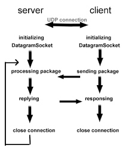

server side:

```java
String messageStr="NACK1";
int server_port = 5000;
DatagramSocket s = new DatagramSocket();
InetAddress local = InetAddress.getByName("192.168.1.102");
int msg_length=messageStr.length();
byte[] message = messageStr.getBytes();
DatagramPacket p = new DatagramPacket(message, msg_length,local,server_port);
s.send(p);
```

client side:

```java
String text;
int server_port = 12345;
byte[] message = new byte[1500]; //incoming message's maximum size.
DatagramPacket p = new DatagramPacket(message, message.length);
DatagramSocket s = new DatagramSocket(server_port);
s.receive(p);
text = new String(message, 0, p.getLength());
Log.d("Udp tutorial","message:" + text);
s.close();
```

###AsyncTask
onPreExecute  -- for doing something before calling background task in Async

doInBackground  -- operation/Task to do in Background

onProgressUpdate  -- it is for progress Update

onPostExecute  -- this method calls after asyncTask return from doInBackground.

###Hybrid ARQ(HARQ)

Reference: [Hybrid ARQ](http://www.nutaq.com/blog/hybrid-arq-part-2)
Hybrid ARQ is the combination of automatic repeat request (ARQ,link layer) and forward error correction (FEC,physical layer). 


There are three main types of ARQ: 

- stop-and-wait
 the transmitter simply sends a sequence and then waits for the ACK. When the ACK is received, the transmitter sends the next sequence. In case of timeout or NAK, it just resends the same sequence and returns to its wait state.

- go-back-N
 use a sequence number to identify each sequence.  restarts the transmission of all the sequences, starting with the first one that wasn’t acknowledged.

- selective-repeat.
 use a sequence number to identify each sequence. only retransmits the sequence that was incorrect
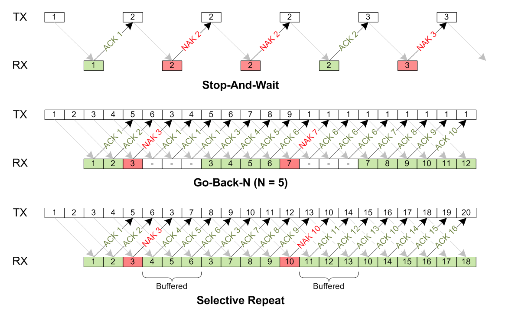


The main advantage of ARQ compared to FEC is that in good propagation conditions, almost no overhead is added, which results in very good throughput. But when propagation conditions start to deteriorate, many retransmissions are required to successfully transmit the data, resulting in a significant increase of latency and a huge decrease of throughput.

###Convolutional coding & Viterbi decoding

1/2 code rate means each bit entering the encoder results in 2 bits leaving the encoder.


